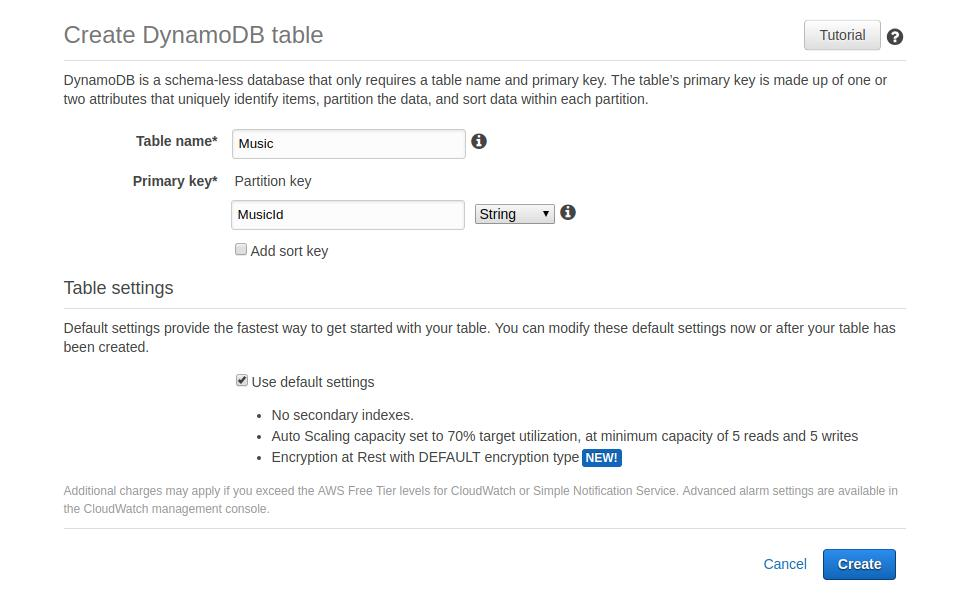

# rest-api-dynamodb
Project to lambda function for API Gateway with DynamoDb

For configuration to Lambda function, above all, you need to create the tables in DynamoDb. And your Table have to be with the value **Primary key**, with same name Table more "Id". 

Exemple Table **User** and Primary Key **UserId**.



Then, you need create a AWS IAM Role with permission in all required tables from the DynamoDb. 

Then, you will create the Lambda function, and to do code upload for your Lambda.

Lastly, you will create the API Gateway and to point all request methods for the Lambda function.

> Obs.
> In your API Gateway, in the option "Integration Request", you must to select option "Use Lambda Proxy integration"

### Exemple
Example of use to api endpoints


#### /user
It Api Gateway is configured the resource with **user** in the methods:

##### GET
```
endPoint: https://{{API_ID}}.execute-api.{{REGION}}.amazonaws.com/{{STAGE}}/user

REQUEST: {
  HEADER: {
    "Content-Type": "application/json"
  }
}

RESPONSE: {
    "statusCode": 200,
    "body": [{
      "UserId": "ABCD-93959-poOd",
      "FullName": "Wanderson Pereira",
      "Email": "wanderson.coord@gmail.com"
    }],
    "headers": {
        "Content-Type": "application/json",
        "Access-Control-Allow-Headers": "Content-Type,Authorization,X-Amz-Date,X-Api-Key,X-Amz-Security-Token",
        "Access-Control-Allow-Methods": "OPTIONS,GET",
        "Access-Control-Allow-Origin": "*",
        "Access-Control-Max-Age": "86400"
    }
}
```

##### POST
```
endPoint: https://{{API_ID}}.execute-api.{{REGION}}.amazonaws.com/{{STAGE}}/user

REQUEST: {
  HEADER: {
    "Content-Type": "application/json"
  }
  
  BODY: {
    "FullName": "Wanderson Pereira",
    "Email": "wanderson.coord@gmail.com"
  }

}

RESPONSE: {
    "statusCode": 200,
    "body": {
      "UserId": "ABCD-93959-poOd",
      "FullName": "Wanderson Pereira",
      "Email": "wanderson.coord@gmail.com"
    },
    "headers": {
        "Content-Type": "application/json",
        "Access-Control-Allow-Headers": "Content-Type,Authorization,X-Amz-Date,X-Api-Key,X-Amz-Security-Token",
        "Access-Control-Allow-Methods": "OPTIONS,GET",
        "Access-Control-Allow-Origin": "*",
        "Access-Control-Max-Age": "86400"
    }
}
```

#### /user/{id}
It Api Gateway is configured the resource with **user/{id}** in the methods:

##### GET
```
endPoint: https://{{API_ID}}.execute-api.{{REGION}}.amazonaws.com/{{STAGE}}/user/ABCD-93959-poOd

REQUEST: {
  HEADER: {
    "Content-Type": "application/json"
  }
}

RESPONSE: {
    "statusCode": 200,
    "body": {
      "UserId": "ABCD-93959-poOd",
      "FullName": "Wanderson Pereira",
      "Email": "wanderson.coord@gmail.com"
    },
    "headers": {
        "Content-Type": "application/json",
        "Access-Control-Allow-Headers": "Content-Type,Authorization,X-Amz-Date,X-Api-Key,X-Amz-Security-Token",
        "Access-Control-Allow-Methods": "OPTIONS,GET",
        "Access-Control-Allow-Origin": "*",
        "Access-Control-Max-Age": "86400"
    }
}
```

##### DELETE
```
endPoint: https://{{API_ID}}.execute-api.{{REGION}}.amazonaws.com/{{STAGE}}/user/ABCD-93959-poOd

REQUEST: {
  HEADER: {
    "Content-Type": "application/json"
  }
}

RESPONSE: {
    "statusCode": 200,
    "body": [],
    "headers": {
        "Content-Type": "application/json",
        "Access-Control-Allow-Headers": "Content-Type,Authorization,X-Amz-Date,X-Api-Key,X-Amz-Security-Token",
        "Access-Control-Allow-Methods": "OPTIONS,GET",
        "Access-Control-Allow-Origin": "*",
        "Access-Control-Max-Age": "86400"
    }
}
```

##### PUT
```
endPoint: https://{{API_ID}}.execute-api.{{REGION}}.amazonaws.com/{{STAGE}}/user/ABCD-93959-poOd

REQUEST: {
  HEADER: {
    "Content-Type": "application/json"
  }
  
  BODY: {
    "FullName": "Wanderson Pereira",
    "Email": "wanderson.coord@gmail.com"
  }
}

RESPONSE: {
    "statusCode": 200,
    "body": [],
    "headers": {
        "Content-Type": "application/json",
        "Access-Control-Allow-Headers": "Content-Type,Authorization,X-Amz-Date,X-Api-Key,X-Amz-Security-Token",
        "Access-Control-Allow-Methods": "OPTIONS,GET",
        "Access-Control-Allow-Origin": "*",
        "Access-Control-Max-Age": "86400"
    }
}
```
